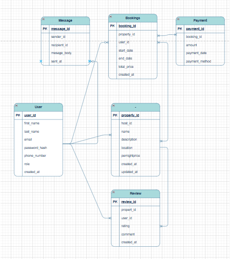

# ERD and relations definitions

## Overview

This Entity-Relationship Diagram (ERD) visually  represent the database structure for the ALX Airbnb Clone project. The  design is based on the given s pecifications and includes key entities such as users, properties, bookings, payents, review, and messages.

## ERD Screenshot

## Entites and Relationships

### 1. **User**
 - Attributes:  `user_id  (PK)`, `first_name`, `last_name`, `email (UNIQUE)`, `password_hash`, `phone_number`, `role (ENUM)` `created_at`
 - Relationships: 
    -A user can **send and receive messages** (`Massge.sender_id`, `Message.recipient_id`)
    - A user can make **multiple bookings**
    - A user can be a **host** of many properties
    - A user can  write  **multiple review**

### 2.  **Property**
-  Attributes: `property_id (PK)`, `host_id (FX)`, `name`, `description`, `locaation`, `pricepernight`, `created_at`, `updated_at`, 
- Relationships: 
    - Each property is **owned by a host (User)**
    - A property can have **many  bookings**
    - A property can have **many reviews**

### 3. **Bookings**
- Attributes: `booking_id (PK)`, `property_id (FK)`, `user_id (FK)`, `start_date`, `end_date`, `total_price`, `created_at`,
- Reationships: 
    - Each booking is made by a **guest (User)** and linked to a **property**
    - Each booking can have **one payment**

### 4. **Payment** 
- Attributes: `payment_id (pk)`, `booking_id (fk) `, `amount`, `payment_date`, `payment_method (Enum)`
- Relationships: 
    - Each payment is linked to a **single booking**

### 5. **Review**
- Attributes: `review_id (pk)`, `property_id (fk)`, `user_id (fk)`, `rating`, `comment`, `created_at`
- Relationships: 
    - A review is  written by a **user** and  is a ssociated with a **property**

### 6. **Message**
- Attributes: `message_id (pk)`, `sender_id (fk)`, `recipient_id (fk)`, `message_body`, `sent_at` 
- Relationships: 
    - Messages are exchanged **between users**

### Notes
- All foreign key contraints are enforced.
- Indexed are  applied on primary key and key columns (e.g, `email`, `property_id`, `booking_id`)
- Enum values are used to ensure data consistency for `role`, `status`, and `payment_method`.